# CPSC 351 <!-- omit from toc -->

* [Fundamental Questions](#fundamental-questions)
* [Required Things](#required-things)
* [Topics](#topics)
* [What he expects of us](#what-he-expects-of-us)
* [Late Work](#late-work)
* [Other](#other)
* [Three parts of "Theory of Computation"](#three-parts-of-theory-of-computation)
  * [Automata Theory](#automata-theory)
  * [Computability Theory](#computability-theory)
* [Mathematical Notions](#mathematical-notions)
* [Definitions](#definitions)
* [Basic Proof Syntax](#basic-proof-syntax)
  * [Types of proofs](#types-of-proofs)
* [Proof by IFF](#proof-by-iff)
* [Proof by contradiction](#proof-by-contradiction)
* [Proof by construction](#proof-by-construction)
* [Proof by Mathematical Induction](#proof-by-mathematical-induction)
* [Theory of Computation (intro)](#theory-of-computation-intro)
* [Finite State Automata (FSA)](#finite-state-automata-fsa)
* [Finite State Machine](#finite-state-machine)
  * [Abstract example](#abstract-example)
* [Finite State Machine (cont.)](#finite-state-machine-cont)
* [Computation on an FSA](#computation-on-an-fsa)
  * [Finite State Automata](#finite-state-automata)
  * [Computation](#computation)
  * [Regular Language](#regular-language)
    * [Regular Operations 1](#regular-operations-1)
* [Regular Operations 2](#regular-operations-2)
* [Non-Deterministic Finite Automata (NFA)](#non-deterministic-finite-automata-nfa)
* [NFA's continued](#nfas-continued)
* [Computational DFA](#computational-dfa)
* [Computational NFA](#computational-nfa)
* [Corollary 1.40](#corollary-140)
* [Regex and Regular Languages](#regex-and-regular-languages)
  * [Examples](#examples)
* [Regex Identities](#regex-identities)
* [Example](#example)
* [Lemma 1.60](#lemma-160)
* [Context Free Languages](#context-free-languages)
  * [Pumping Lemma](#pumping-lemma)
* [Context Free Language](#context-free-language)
* [Terminology](#terminology)
* [Chomsky](#chomsky)
* [Push Down Automata](#push-down-automata)
* [Push Down Automata (Cont.)](#push-down-automata-cont)
* [Theorem 2.21](#theorem-221)
* [From PDA's to CFG's (and back)](#from-pdas-to-cfgs-and-back)
* [The Pumping Lemma for Context Free Languages](#the-pumping-lemma-for-context-free-languages)

## Fundamental Questions

* Everything will be on his website besides grades
  * Website: <www.paolodepalma.com>

The fundamentals of this class are based on Allan Turing

* What are the capabilities and limitations of computers/
* what is a computational model?
* What is computability?
* What is a formal language?
* How are formal languages related to computational models?
* Are there problems are that are unsolvable?
  * Yes

## Required Things

* Textbook (See site)
* Lots of time, patience, distraction-free environment
* *Pen and paper*
* No electronic gadgetry of any sort. "These prevent you from being a full participant in the class"

## Topics

* Chapter 0: Preliminaries (1.5 weeks)  
  * 0.1 Automata, Computability, and ComplexityPreliminaries  
  * 0.2 Strings and languages  
  * 0.4 Types of proofs  
* Chapter 1: Regular Languages (3 weeks)  
  * 1.1 Finite Automata  
  * 1.2 Nondeterminism  
  * 1.3 Regular Expressions  
  * 1.4 Nonregular Languages  
* Chapter 2: Context-Free Languages (3 weeks)  
  * 2.1 Context-Free Languages  
  * 2.2 Pushdown Automata  
  * 2.3 Non-Context-Free Languages  
  * 2.4 Deterministic Context-Free Languages  
* Chapter 3: The Church-Turing Thesis (3 weeks)  
  * 3.1 Turning Machines  
  * 3.2 Variants of Turing Machines  
  * 3.3 The Definition of Algorithm  
* Chapter 4: Decidability (2 weeks)  
  * 4.1 Decidable Languages  
  * 4.2 Undecidability
* Chapter 5: Reducibility (2 weeks)  
  * 5.1 Undecidable Problems  
  * 5.2 The Post Correspondence Problem  
  * 5.3 Mapping Reducibility  

## What he expects of us

* To have fun
* To be dazzled by the beauty of computational theory
* To know when to quit
  * Go to the gym
  * Take a bike ride
  * Call your parents

## Late Work

* Assignments are due on the date posted
* You may resubmit graded problem sets for a higher grade. These must have a score of 70% or higher
* The protocol is to appear at my office hours by Friday after the problem set was returned, with the prepared problems

## Other

* Quizzes once a week. (14 of them, total 5% of grade)
* **Use LaTeX to get extra credit!**
* Calendar
* Every Sunday the calendar is updated for the following week

## Three parts of "Theory of Computation"

1. Automata Theory
2. Compatibility Theory
3. Complexity Theory

### Automata Theory

Definition and properties of mathematical models of computation

Three major models:

1. Finite State Automata
    * Regular languages
    * Regular Grammars (and regular expressions)

2. Push down automata
   * Context Free Languages
   * Context Free Grammars

3. Turing Machines
   * Recursively Enumerable Languages
   * Phrase Structure Grammars

Another View:

* FSA's are computing models with no memory
* PDA's are computing models with stack memory
* TM's are computing models with infinite memory

### Computability Theory

Given a Turing Machine:

* What is and is not computable?
  * Halting Problem: does a TM halt under a given input
* Decidability
  * Is string `s` a member of the language generated by grammar `g`
* Why are some problems hard and others easy?
  * Sorting is easy
  * Scheduling is hard
* How do you characterize complexity: Big O Notation
* How do you classify difficult problems

This course is overwhelmingly about automata theory with an excursion into computability theory

## Mathematical Notions

* Sets and operations on sets
  * Definition
  * Empty set
  * Union
    * In A and B
  * Intersection
    * In both A and B
  * Complement
    * Everything not in that set
* Sequences and tuples
  * Ordered Pair
    * (a, b)
  * Cartesian Product

* Mapping
* Domain
* Range
* Edges & Vertices
* Degree of a Vertex
* Cycle, connected graph
* Function Types
  * Injective
    * one-to-one function
  * Surjective
    * onto function
  * Bijective (one-to-one correspondence)
    * both one-to-one and onto

Predicate or Property: Function whose range is ${T,F}$

* Let `even` be a property that maps to `T`` if its input is an even integer,`F`otherwise`

Binary Relations

* A binary relation`R`
  1. is *reflective* if for every x in the domain, xRx → T
  1. is symmetric if for every x and y in the domain, xRy implies yRx
  1. is transitive if for every x, y, and z in the domain, xRy and yRz implies xRz
* A equivalence relation in R is an equivalence relation if R satisfies 1, 2, 3

Relation Example:  
Define a relation on the integers numbers written: $eq_{7}$
Let $Z$ be the set of integers.
For all $i, j \in Z$, $i eq_{7}j$ if $i - j$ is a multiple of $7$

Proof:
eq7 is reflexive  
i - i = 0 which is a multiple of 7 (9 - 9 = 0, which is a multiple of 7)  
eq7 is symmetric  
i - j is a multiple of 7 if j - i is multiple of 7  
said another way  
Suppose j - i = p\*7, where p is the multiple.  Then i - j = (-p)\*7, where the multiple is -p
2 - 9 = -7, a multiple of 7, so 9 - 2 = 7, a multiple of 7  
eq7 is transitive  
if i, j, k are integers and both (i - j) and (j - k) are multiples of 7,  
then (i - j) + (j - k) = (i - k)  
The sum of two multiples of 7 is a multiple of 7.  So, (i - k) is a multiple of 7.  
Said another way:  
i - j = p\*7, j - k - q\*7  
(i-j) + (j-k) = p\*7 + q\*7  
(i-k) = 7(p+q)  
so (i-k) is a multiple of 7

Since eq7 is reflexive, symmetric, and transitive, eq7 is an equivalence relation

Assignment due a week from today (Thursday):

* In class, or during office hours

## Definitions

* Definition
  * Precise description of the objects and notions in use
  * The words describing $eq_{7}$ constitute a definition
* Mathematical Statement
  * Some object has a certain property. The statement may or may not be true, but it **MUST** be unambiguous
* Proof
  * A convincing logical argument
  * Law: beyond reasonable doubt
  * Mathematic: beyond any doubt
* Theorem
  * Mathematical statement that has been proved to be true
* Lemma
  * A mathematical statement proved try that is helpful in the proof of a more significant statement
    * in the language of computing - a subroutine
* Corollary
  * A mathematical statement easily concluded from a theorem
* Equivalent Conditionals
  * Let P and Q be mathematical statements where P is the hypothesis and Q is the conclusion. These expressions mean the same thing
    * P implies Q
    * P $\implies$ Q
    * if P then Q
    * Q only if P
    * Q if P

## Basic Proof Syntax

$$
P,Q\newline
P \implies Q\newline
if\ P\ then\ Q\newline
Q\ only\ if\ Q\newline
Q\ if\ P\newline
P \implies Q\newline
$$
| P   | Q   | $P\implies Q$ | P=Q |
| --- | --- | ------------- | --- |
| F   | F   | T             | T   |
| F   | T   | T             | F   |
| T   | F   | F             | F   |
| T   | T   | T             | T   |

$$
Suppose:\newline
P \implies Q\newline
Q \implies P\newline
(P \implies Q) \not = (Q \implies P)
$$
| P   | Q   | $P\implies Q$ | $Q=P$ | $(p \implies q) = (q \implies p)$ |
| --- | --- | ------------- | ----- | --------------------------------- |
| F   | F   | T             | T     | T                                 |
| F   | T   | T             | F     | F                                 |
| T   | F   | F             | T     | F                                 |
| T   | T   | T             | T     | T                                 |

* $P \implies Q$
* $\neg Q \implies \neg P$ (Contrapositive)
* $P \iff Q$
  * $P \implies Q \And Q \implies P$
    * (P implies Q and Q implies P)

### Types of proofs

* IFF (if an only if) $\iff$
* Contradiction
* PMI
* Construction

## Proof by IFF

Theorem: For any two Sets, A, B, complement of A union b implies com A n com B

```latex
pf
suppose X is not ian element of A union B

Step 1: $\bar{A u\ B} \implies \bar A n \bar b$
by def of comploment, X is not in A u B
x is in $\bar A$ and x is in $\bar b$

by def of intersection
x is in $\bar A$ intersects $\bar b$
which is what we want to show

Step 2
not A n not b om,plies not(a u b)
suppose x is in not a n not b, then
    x is in not a
    x is in not b
    -> def of intersection
then x is not in a u b
by def of complement
    x is in not (a u b)
    which proves step 2

since step 1 and step 2, we prove the theorem
```

## Proof by contradiction

```latex
assume that the thing you are proving is false, then you draw a series of correct implications, it will lead to a complication (something that is not true)

Theorem:
\sqrt{2} is irrational

(rational number means a number that can be represented as a ratio of two integers (1:2, 5:100, etc), irrational is just not that)
(lemma is a subroutine, something that is easy to prove and be used inside a larger proof)

Lemma-
    if p^2 is an even integer, p is an even integer
    pf.
        p^2 is p*p
        since p^2 is even, there exists (backwards E) some L such that (S.T):
            (p^2)/2 = L
            p*p = 2L
            L = p*p)/2
            L is even


root 2 is irrational
    assume root 2 is rational
    then root 2 = m/n where m, n , are integers
    let k = gcd(m,n) <- greatest common divisor
        (m/k)/(n/k) = m/n
        let \frac{m}{k} = p
        \frac{n}{k} = q
        \sqrt{2} = \frac{m}{n} = \frac{p}{q}
        at least one of P, Q is odd
            (sub proof)
            Suppose both P, Q are even 
            \frac{m}{k} = p = 2*R
            \frac{n}{k} = q = 2*T
            -----
            So m,n would have 2k as gcd, contradicting our assumption that k is the gcd

    \sqrt 2 = m/n = p/q
    sqrt(2) q = p
        A. 2q^2 = p^2
        \implies p^2 is even! (divisible by 2)
        -> p is even by the Lemma
        since p is even, it may be written p = 2R

    2q^2 = p^2
    2q^2 = 4R^2
    q^2 - 2R^2
    q^2 is even
    -> q is even
    Both q and p are even
        but we have already shown that at least one of the two is odd       
    (contradiction!)
Assumption that \sqrt 2 is rational led to a contradiction, so \sqrt 2 is irrational
```

Little quiz on Thursday

## Proof by construction

By some theorem, it asserts that some object exists
the proof is a step-by-step instruction for how to actually define this project
This type of proof is very rare

e.g.

```latex
Def: A graph is k-regular if every vertex in the graph has k edges (degree k)
Theorem: Let n be the number of vertices in a graph; for every n>2, there exists a 3-regular graph

constL:
1. Draw a circle
2. Distribute vertices evenly about the circle
3. Draw edges between adjacent vertices -> yields 2 edges per node
4. Draw edges between opposite vertices -> yields an additional edge

step 3:
a = the edges between v
a = {(i, i + 1) for 0 <= i <= n-2 U (n-1, 0)}
    (these are a set of tuples, and they contain these vertices that contain vertex a and vertex b, representing the line)

step 4:
b = the edges between opposite vertices 
b = {(i, i + floor(n/2)) for 0 <= i <= floor(n/2) - 1}
```

## Proof by Mathematical Induction

* Why do we do this?
  * When working with an infinite set
* two parts: base case, and induction/hypothesis
  * we want to make a close-form formula that proves an infinite set
* we make this induction hypothesis, similarly to dominoes
* true for k, and true for k + 1

```latex
Loan 
I > 0 : annual interest rate
P: principal (amount you have borrowed)
m: multiplier (amount by which the loan changes each month)

m = 1 + (I/12)
y: Monthly payment

Let 
I = 12%
P_{t}: amt of loan outstanding after t months
(we can see that this is an recurrance relationship)
P_{0} = P
P_{1} = P_{0} * m - y

Let P_{0} = 100000
P_{1} = 100000 * (1 + (0.12/12)) - y
      = 100000 * 1.01 - y
----
P_{0} = P
P_{1} = P_{0} * m - y
P_{2} = P_{1} * m - y
P_{k+1} = P_{k} * m - y

Theorem: 
for all t >= 0 
P_{t} = P*m^{t}-y((m^{t}-1)/(m-1))

Basis:
P_{0}   = P*m^{0}-y((m^{0}-1)/(m-1))
        = P 
Induction Step:
for each k >= 1, assume the formula is true for t=k;
P_{k}   = P*m^{k}-y((m^{k}-1)/(m-1))
show that this implies 
P_{k+1} = P*m^{k+1}-y((m^{k+1}-1)/(m-1))

We know P_{k} by assumption
P_{k+1} = [P*m^{k}-y((m^{k}-1)/(m-1))]*m-y
        = P*m^{k+1}-y((m^{k+1}-m)/(m-1)-y 
        [use ((m-1)/(m-1)) as a common denom]
        = P*m^{k+1}-y((m^{k+1}-m+m-1)/m-1)
        = P*m^{k+1}-y((m^{k+1}-1)/m-1)
        = what we wanted to show!
```

## Theory of Computation (intro)

* Alphabet: non-empty finite set of symbols {0,1}  
* Sequence: list of objects in some order  
* String (over an alphabet): finite sequence of symbols drawn from some alphabet  
* Empty string: a string of length 0 (sometimes written as an epsilon, mostly written as lambda)  
* Reverse: if S is a string $S^{r}$ is its reverse:
  * S = 01011  
  * $S^{r}$ = 11010  
* Concatenation: if x is a string of length m, |x| = m, y is a string of length n, |y| = n, xy is the string of length n+m obtained by appending y to the tail of x.
  * x=0101
  * y=11
  * xy=010111
* String exponentiation: x is a string, $x^{k}$ is the string obtained by appending x to itself k times
* Lexicographic order: "dictionary order"
* ShortLex (string order): length within a lexicographic order
  * E_{1} = {0,1}
  * Shortlex: {0, 1, 00, 01, 10, 11, 000, ...}
* Prefix: x is a string. It is a prefix if z (a string) exists such that xz = y where x, y, z are strings
  * y = 0101
  * x = 0
  * z = 101
  * (x is a prefix of y)
* Language: set of strings

## Finite State Automata (FSA)

These are very abstract devices

Imagine there is a door, and a pad to go in, and out.
The store will behave differently depending on which pad they go in.
we want to model that door
front pad detects a person and opens the door
back door holds an already open door

FSA has two states:

1. Closed State
2. Open State

Detect Signals:

* R
  * Something on the rear pad
* F
  * Something on the front pad
* B
  * Something on both the front and rear pads
* N
  * Nothing on either the front or rear pads

Closed:

* stays closed in R, B, N
* opens in F
Open:
* stays open in F, R, B
* closes on N

## Finite State Machine

It ONLY knows what state it is in

Continuing the pad/store example

* Pad_f and Pad_r
* they detect signals and change depending on the state
* Signals:
  * R (something on pad r)
    * Closed:
      * Stay closed
    * Open
      * Stay opened
  * F (something on pad f)
    * Closed:
      * Open
    * Open:
      * Stay open
  * B (something on both pad r and f)
    * Closed:
      * Stay closed
    * Open:
      * Stay open
  * N (nothing on both pad r and f)
    * Closed:
      * Stay closed
    * Open:
      * Close

### Abstract example

m1 (for machine 1)

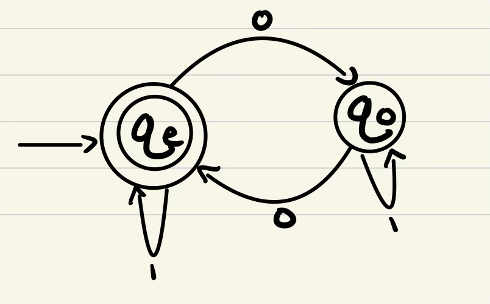

an FSA is a 5-tuple

* Q
  * A finite set, called "states"
* $\Sigma$
  * A finite set called "alphabet"
* $\Delta$
  * A function: $\delta Q \times \Sigma \Rarr Q$
    * Cartesian product, "Q cross Sigma"
* $Q_{s}$
  * $Q_{s} \epsilon Q$ called "start state"
* $F \subseteq Q$
  * A proper subset of Q

$
m_1
\\
Q=\{q_1, q_2, q_3\}
\\
\Epsilon = \{0, 1\}
\\
q_s = q_1
\\
F=\{q_2\}
\\
\delta(q_1, 0) \rarr q_1
$

$\delta$
A language is a set of strings
A string is a sequence of symbols

## Finite State Machine (cont.)

$\Sigma$ is a finite state called "Alphabet"

$\Sigma^*$ is a set of strings such that

1. $\lambda$ (empty string) $\in \Sigma^*$
2. if $w \in \Sigma^*$ and $a \in \Sigma$, then $wa \in \Sigma^*$
3. $w \in \Sigma^*$ only if it can be obtained from $\lambda$ by a finite number of applications of (2)

$m_2$
let $\Sigma = \{0, 1, 2\}$
$\implies \Sigma^*$ is any seq of $\lambda, 0, 1, 2$  
$A=L(m_2) \{w|w \in \Sigma^*$ and the sum of the elements of $w$ is a multiple of 3$\}$

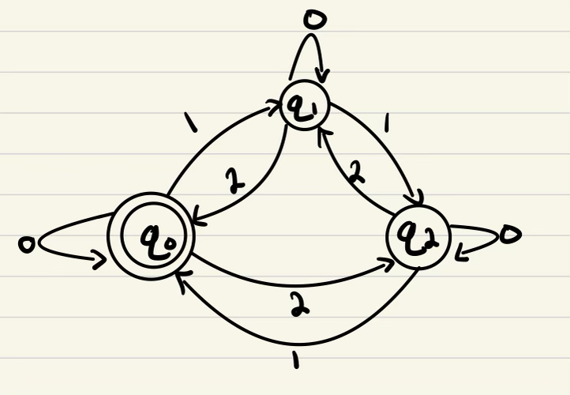

## Computation on an FSA

### Finite State Automata

Let $m = (q_1, \Sigma, \delta, q_s, F)$ be an FSA  
Let $w= w_1, w_2, ..., w_n$ be a string where each $w_i \in \Sigma$  
then $m$ accepts (recognizes) $w$ if a sequence of states: $r_0, r_1, ..., r_n$ in $Q$ exist, such that:

1. $r_0 = q_r$
2. $\delta (r_i, w_{i+1}) r_{i+1} \text{ for } i = 0 ... n - 1$
   * w i +1 is the next letter in the sequence, and r_{i+1} is also next in the sequence
3. $r_n \in F$

This basically means, "is there a path in the FSA, where if you exhaust an input, you'll be at the end of the FSA"

### Computation

Def: An action of an FSA over a string meeting the three conditions

Languages;

* FSA (DFA)
  * There is a machine, and a set of strings that are put together in a particular kind of way that can be recognized by an FSA.
  * A collection of strings recognized by an FSA is called a language
  * the col of all strings recognized by all FSA's are referred to as "regular languages"
  * >Regular expressions are regular languages
* Push Down Automata
  * An FSA with a stack
  * >Context free language
* Turing Machine
  * A push down automata with infinite memory
  * Recursively Enumerable

### Regular Language

1. A language over an alphabet is a subset of $\Sigma^{*}$
2. Language of a machine $m$ is the set of strings the machine accepts

A language is regular if some FSA accepts it

$\Sigma = {0, 1}$  
Design an FSA that accepts all strings with an even number of 0s

1. Define the states
   1. odd so far
      * $q_o$
   2. even so far
      * $q_e$

$\text{in } q_e, 0 \Rarr q_o$  
$\text{in } q_o, 0 \Rarr q_e$
$\text{in } q_e, 1 \Rarr q_e$  
$\text{in } q_o, 1 \Rarr q_o$  


$(Q, \Sigma, \delta, q_s, F)$  
Lets set $q_s$ to be $q_e$

* the set of integers are closed under `+, -, *` because these take in and return integers always
* An algebra is a collection of elements and a set of operations on those elements (think linear algebra)
  * We want to define the algebra of regular languages

#### Regular Operations 1

Let $A, B$ be regular languages (a set of strings that is accepted by an FSA)

1. Union
   1. $A \cup B = \{ x | x \in A \text{ or } x \in B\}$
2. Concatenation
   1. $A \cdot B = {xy | x \in A \text{ and } y \in B}$
3. Kleene Star
   1. $A^{\star} = {x_0, x_1, ..., x_k | k \ge 0 \text{ and each } x_i \in A}$

$
ex\\
\Sigma = {a, b} \\
A = {a,b} \\
B={ab,ba} \\
A \cup B = {a,b, ab, ba} \\
a \cdot b = {aab,aba, bab, bba} \\
A^{\star} = \text{ the set of all possible concatenations over }A
$

Theorem 1.25  
The class of regular languages is closed under union


$
\delta(q_1, q_2) \rarr q_2\\
\delta((r_1,r_2),a) = \delta_1(r_1,a), \delta_2(r_2,a)
$

Theorem 1.25  
The class of regular languages is closed under union

Proof:

1. Let $m_1$ be an FSA that accepts A
1. Let $m_2$ be an FSA that accepts B
1. Construct $m$ that recognizes $A \cup B$
   * $m+ (Q, \Sigma, \delta, q_s, F)$
   1. $\{(r_1,r_2)|r_1 \in Q_1 \And r_2 \in Q_2 \text{ when } Q_1$ is the set of states of $m_1 \And Q_2$ is the set of states of $m_2\}$
      1. $(r_1, r_2) Q_1 \text{X} Q_2$
   2. $\Sigma$ is the same for $m_1, m_2$
   3. $\delta((r_1,r_2),a) = (\delta_1(r_1,a),\delta_2(r_2,a))$
   4. $q_s = (q_{s_{1}}, q_{s_2})$
   5. $F$ is a set of tuples in which either element is an accept state of $m_1$ or $m_2$
      1. $F=\{(r_1,r_2) | r_1 \in F_1$ or $r_2 \in F_2\}$

## Regular Operations 2

Theorem 1.26  
The class of regular languages is closed under concatenation  
(Closed means that it is an operation between multiple members of a language, the result is still contained in the language)

$m_1$: even 0s  
$m_2$: only three 1s


## Non-Deterministic Finite Automata (NFA)

DFA: Given a state and symbol, it can go to a specific state

NFA:

* At each state, a specific input could lead to several states
* if any input ultimately leads to accept state: success

DFA: $\delta$ is a function from $Q$ X $\Sigma \rArr \{q_j\}$

NFA: $Q$ X $\Sigma$ to $P(Q)$ (power set of Q)

$\delta$ in an NFA:


$\{\{a,b\}^*bb\}=L$


abbabb

$$
[q_0, \text{abbabb}]\\
\vdash [q_0, \text{bbabb}] \\
\vdash [q_1, \text{babb}] \\
\vdash [q_2, \text{abb}] \\
\vdash [q_2, \text{abb}] \\
\vdash [q_0, \text{bb}] \\
\vdash [q_1, \text{b}] \\
\vdash [q_2, \lambda]
$$

This also works!


Non-determinizion: the input doesn't determine functionally where we are going to go

As a fork: ababb

When there is a fork, you instantaneously go in both directions


$\lambda (\epsilon)$ transition (lambda, epsilon)  
$\delta : Q$ X $\Sigma \rarr Q$
>Since sigma is a set and contains an empty element, one possible input is lambda (the empty string)


010110 (Figure 1.29)


## NFA's continued

$N_2: \Sigma=\{0,1\}$  
Language: all strings over sigma that contain a 1 in the third position from the end  


Formal definition of an NFA:

$(Q, \Sigma, \delta, q_s, F)$

1. $Q$ is a finite set of states
2. $\Sigma$ is a finite alphabet
3. $\delta$: $Q \times \Sigma_{\lambda}$
4. $q_s \in Q$ is the start state
5. $F \in Q$ is the set of accept states  

$Q=\{q_1,q_2,q_3,q_4\}$  
$\Sigma = \{0, 1, \lambda\}$  
$\delta$

| State | 0         | 1             | $\lambda$ |
| ----- | --------- | ------------- | --------- |
| $q_1$ | $\{q_1\}$ | $\{q_1,q_2\}$ | $\phi$    |
| $q_2$ | $\{q_3\}$ | $\phi$        | $\{q_3\}$ |
| $q_3$ | $\phi$    | $\{q_4\}$     | $\phi$    |
| $q_4$ | $\{q_4\}$ | $\{q_4\}$     | $\phi$    |


## Computational DFA

m accepts w if a sequence of states $r_0,r_1, ... , r_n$ in $Q$ exist with these 3 conditions

1. $r_0 = q_s$
2. $\delta(r_i, w_{i+1}) = r_{i+1}$ for $i = 0, 1, ..., n-1$
3. $r_n \in F$

## Computational NFA

1. the same
2. $r_{i+1} \in \delta(r_i, w_{i+1})$ for $i = 0, ... , n-1$

Theorem 1.39

* Every NFA has an equivalent DFA

Proof:

* Given an abstract NFA, construct a DFA
  * Let $N=\{Q,\Sigma,\delta,q_s,F)$ be an NFA
    * Such that $A=L(N)$
  * Using $N$, we will construct a DFA
    * $M+=Q',\Sigma,\delta',q_s',F')$
      * Such that $A+L(M)$
  * 5 Steps
    1. $Q'=P(Q)$
       1. power set of Q
    2. For $R \in Q '$ and $a \in \Sigma$
       1. Let $\delta'(R,a) = \Sigma q \in Q| q \in \delta(r,a)$ for some $r \in R$
          1. Every transition in $N$ generates a set of transitions in $M$
    3. $q_s' = \{q_s\}$
    4. $F'=\{R \in Q' | R$ contains an accept state pf $N\}$
    5. Lambda transitions
       1. Let $R \subset Q$
       2. $E(R) = \{q | q \text{ can be reached  from } R \text{ by zero or more } \lambda \text{ transitions}\}$
          1. EX:
             * 
             1. $E(\delta(1,b)) = E(\{2\}) = \{2\}$
             1. $E(\delta (1,a)) = E(\phi) = \phi$
             1. $E(\delta (3,a))=E(\{1\})=\{1,3\}$
             1. $\delta'(R,a)=\{q \in Q | q \in \delta(r,a) \text{ for some } r \in R\}$

Theorem 1.39

* Every NFA has an equivalent DFA

Proof:

* Given an abstract NFA, construct a DFA
  * Let $N=\{Q,\Sigma,\delta,q_s,F)$ be an NFA
    * Such that $A=L(N)$
  * Using $N$, we will construct a DFA
    * $M+=Q',\Sigma,\delta',q_s',F')$
      * Such that $A+L(M)$
  * 5 Steps
    1. $Q'=P(Q)$
       1. power set of Q
    2. For $R \in Q '$ and $a \in \Sigma$
       1. Let $\delta'(R,a) = \Sigma q \in Q| q \in \delta(r,a)$ for some $r \in R$
          1. Every transition in $N$ generates a set of transitions in $M$
    3. $q_s' = \{q_s\}$
    4. $F'=\{R \in Q' | R$ contains an accept state of $N\}$
    5. Lambda transitions
       1. Let $R \subset Q$
       2. $E(R) = \{q | q \text{ can be reached  from } R \text{ by zero or more } \lambda \text{ transitions}\}$
          1. EX:
             * 
             1. $E(\delta(1,b)) = E(\{2\}) = \{2\}$
             1. $E(\delta (1,a)) = E(\phi) = \phi$
             1. $E(\delta (3,a))=E(\{1\})=\{1,3\}$
             1. $\delta'(R,a)=\{q \in Q | q \in \delta(r,a) \text{ for some } r \in R\}$
             1. $\delta'(r,a) = \{q \in Q | q \in E(\delta(r,a)) \text{ for some } r \in R\}$

## Corollary 1.40

A language is regular if and only if an NFA recognizes it.

> Proof:  
> A regular language is defined as something recognized by a DFA  
> And since every DFA has an NFA...

Example

$N_4$


$
Q=\{1,2,3\} \\
Q'=\{\phi,\{1\},\{2\}\{3\},\{1,2\},\{1,3\},\{2,3\},\{1,2,3\}\} \\
q_s=1 E(1)=\{1,3\} \\
F=\{1\} \\
F'=\{R \in Q' | R \text{ contains an accept state of } N_4\} = \{\{1\},\{1,2\},\{1,3\},\{1,2,3\}\} \\
$

Transitions

$\delta'(Ra) = \{q \in Q|q \in E(\delta(r,a)) \text{ for some } r \in R\}$

* $\{\phi\}$
   1. $E(\delta(\phi,a))\rarr E(\phi)=\phi$
   2. $E(\delta(\phi,b))\rarr E(\phi)=\phi$
* $\{1\}$
   1. $E(\delta(1,a))\rarr E(\phi)=\phi$
   2. $E(\delta(1,b))\rarr E(\{2\})=\{2\}$
* $\{2\}$
   1. $E(\delta(2,a))\rarr E(\{2,3\})=\{2,3\}$
   2. $E(\delta(2,b))\rarr E(\{3\})=\{3\}$
* $\{3\}$
   1. $E(\delta(3,a))\rarr E(\{1\}))=\{1,3\}$
   2. $E(\delta(3,b))\rarr E(\phi)=\phi$
* $\{1,2\}$
   1. $E(\delta(1,2))\rarr E(\{1,2\},a))=E(\delta(\{1\},a)\cup\delta(\{2\},a))=\{\phi\cup\{2,3\}=\{2,3\}\}$
   2. $E(\delta(\{1,2\},b))\rarr E(\delta(\{1\},b) \cup\delta(\{2\},b))=E(\{2\}\cup\{3\}\{2,3\}$
* $\{1,3\}$
   1. $E(\delta(\{1,3\},a))=E(\delta(1,a)\cup(3,a))=E(\phi\cup\{1,3\})=\{1,3\}$
   2. $E
* $\{2,3\}$
   1. $E(\delta(\{2,3\},a))\rarr=E(\delta(2,a)\cup\delta(3,a))=E(\{2,3\}\cup\{1,3\})=\{1,2,3\}$
   2. $E(\delta(\{2,3\},b))=E(\delta(2,b)\cup\delta(3,b))=E(\{3\}\cup\phi\})=\{3\}$

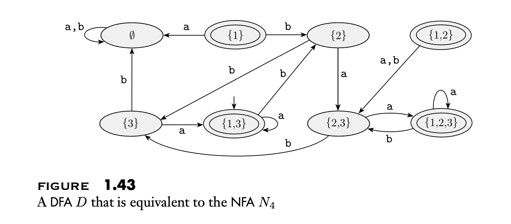

b: \{2\}\cup\{3\}\phi\rarr \{2,3\}

Proving that Regular languages are closed under concatenation

>Theorem 1.47  
>The class of regular languages is closed under concatenation

Technique: Proof by construction

* Build 2 NFAs: N1, N2
  * A=L(N1)
  * B=L(N2)
* Construct NFA N3
  * Use N1 to recognize A
  * Use N2 to recognize B
* "Since this NFA recognizes the concatenation of two regular languages, then I will have proven that regular languages are closed under concatenation"

Proof:

$
\text{Let } N_1 = (Q_1, \Sigma, \delta_1, q_1, F_1) \text{ recognizes A}\\
\text{Let } N_2 = (Q_2, \Sigma, \delta_2, q_2, F_2) \text{ recognizes B}\\
\text{Construct:}\\
N = (Q_1, \Sigma_{\lambda},\delta, q_1, F_2)\\
Q= Q_1 \cup Q_2\\
\text{Start State of } N = \text{ start state of }N_1\\
\text{Accept states of } N = \text{ accept states of } N_2\\
\Sigma_{\lambda} = \Sigma \cup \lambda\\
\text{Define } \delta \text{ such that } \forall q \in Q_1, a \in \Sigma_{\lambda}\\
\delta(q,a)=
\left\{
  \begin{array}{ll}
    \delta_1(q,a), q \in Q_1 \And q \not\in F_1 \\
    \delta_1(q,a), q \in F_1 \And a \not = \lambda \\
    \delta_1(q,a) \cup \{q_2\}, q \in F_1, and a=\lambda \\
    \delta_2(q,a), q \in Q_2
  \end{array}
\right.
\\
N \text{ is an NFA that recognizes } A \cup B
$

## Regex and Regular Languages

Using Regular Operations to build regular expression

$
A=\{\{0,1\},\{0\}^{*}\} \Rarr \text{Regular language} \\
(0 \cup 1)0^* \Rarr \text{regular expression} \\
$

Def: $R$ is a Regular Expression if $R$ is:

1. 'a' for some 'a' in $\Sigma$
2. $\lambda$ (the empty string)
3. $\phi$ (the language with no strings)
4. $(R_1 \cup R_2)$ where $R_1$ and $R_2$ are Regular Expressions
5. $R_1 \cdot R_2)$ where $R_1$ and $R_2$ are Regular Expressions
6. $(R_1)^*$ where $R_1$ is a Regular Expression

Def: Regex

* if $R$ is a Regular Expression, $R^{+} = RR^*$
* if $R$ is a Regular Expression, $L(R)$ is the language that $R$ describes

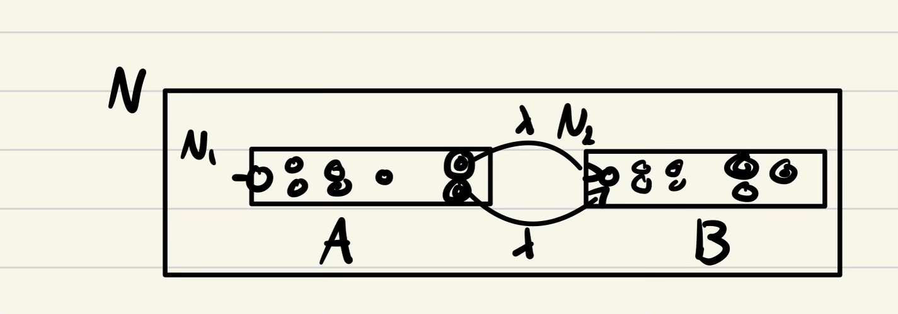

### Examples

Let $\Sigma = \{0,1\}$

1. $\Sigma^* 1 \Sigma^* = \{ w | w \text{ has at least one 1}\}$
1. $1^* (0 1^+)^* = \{w | \text{ every 0 is followed by at least one 1}\}$
1. $0\Sigma^*0\cup1 \Sigma^* 1\cup 0 \cup 1 = \{w | w \text{ starts and ends with the same symbol, and can't be empty}\}$

## Regex Identities

1. $1^* \phi = \phi$
2. $\phi^* =\{\lambda\}$

> Theorem 1.54:  
> A language is regular if and only if it can be described by a regular expression.
> Proof:  
> Lemma 1.55:  
> If a language, $L$, can be described by a regex, $R$, $L$ is regular.
> Proof:  
> $L$ is described by a regex, $R$.  

$R$ is a regex if:

1\. $'a'$ (any character)

> $R$ is a regex if $R$ is 'a' for some 'a' $\in \Sigma$
> NFA, $N$, such that $L(N) = L(R)$
> $Q=\{1,2\}$
> $\Sigma=\{'a'\}$
> $q_s = 1$
> $F=\{2\}$
> $\delta(1,'a')=2$
> $\delta(q_i, b) = \phi, r \not = 1 \text{ or } b \not \in \Sigma$

2\. $\lambda$

> $R$ is a regex if $L(R) = \lambda$
> $\rarr$ then $L(R) = \{\lambda\}$
> > $Q=\{1\}$
> > $\Sigma = \{\lambda\}$
> > $q_s = 1$
> > $F = \{1\}$
> > $\delta(r,b) = \phi \forall r, \forall b$

3\. $\phi$

> $R=\phi$
> $q_s=q_1$
> $F=\phi$
> $\delta(r,b) = \phi \forall r, \forall b$

4\. $(R_1 \cup R_2)$

> Proof is very similar to the existing proof for union

5\. $R_1 \cdot R_2$

> Proof is very similar to the existing proof for concatenation

6\. $R_{1}^*$

> Proof is very similar to the existing proof for kleene star

## Example

$(a b \cup a )^*$

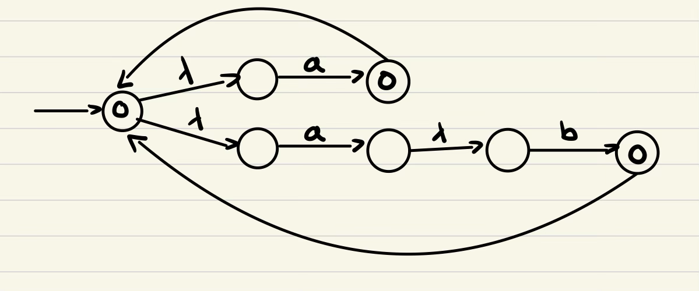

## Lemma 1.60

> Lemma 1.60
> If a language is regular, it can be described by a regex.

This will be shown through an example

$a^* b(a \cup b)^* = R$  
Build a DFA that accepts this language

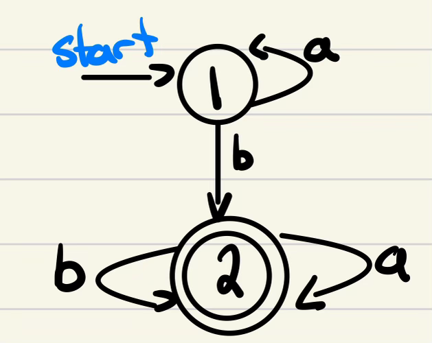

GNFA:

* No transitions from non-start state to start state
* No transitions leave to accept state
* All states except start and accept are connected
* "A GNFA is a generalized non-deterministic finite automata, is a DFA with all the nodes connected."

Now we modify this to be a GNFA

$\phi$ arrows

* delta generates a state
* we want to add these phony transitions that don't really do anything, so we indicate the non-generation of a state with a $\phi$ symbol

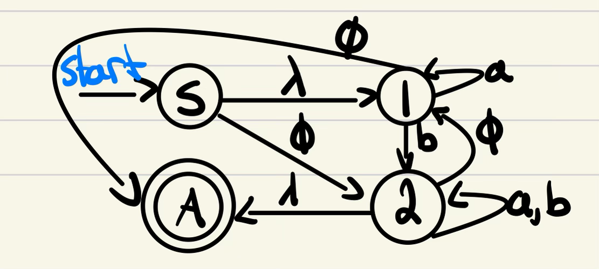

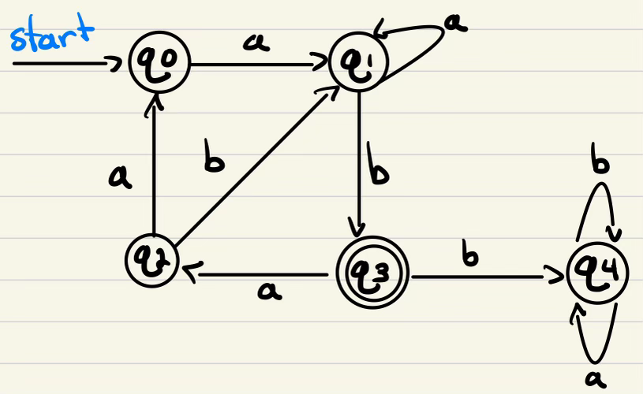1

## Context Free Languages

* Is this language regular
  * $\Sigma = \{a,b\}$
  * $L = \{a^i, b^i \space \forall i \ge 0\}$
  * Nope. Try $aaab \cdot ab$

This is a context free language, because you can't draw the machine

### Pumping Lemma


1. a bab b
2. a bab bab b

The *pump*ing part is the bab's, in between the a and b

* S = aa bab baab
  * x = aa
  * y = bab
  * z = babb
* You visit q1 twice in this scheme
  * q1 q3 q2 q1
* $x, y, z, z \in L(m)$
  * so is $xy^iz, i \ge 0$

$S=S_1S_2S_3S_4S_5S_6...S_n\\$
$S=(q_1) S_1 (q_3) S_2 (q_{20}) S_3 (q_9) S_4 (q_{17}) S_5 (q_9) S_6 (q_6) ... (q_{35}) S_n (q_{13} \text{[accept]})$

* X takes $m$ from $q_1$ to $q_9$
* y takes $m$ away from $q_9$ and back
* z takes $m$ to $q_13$

If $A$ is a regular language, then there is a number $P$, the pumping length, where if $S$ is any string in $A$ of length at least $P$, then $S$ may be divided into 3 parts, $S=xyz$ such that:

1. for each $i \ge 0, xy^iz\in A$
2. $|y|\gt0$ (cardinality)
3. $|xy|\le P$ (cardinality)

Proof:

* Let:
  * $m=(Q, \Sigma, \delta, q_s, F)$
  * $L(m) = A$
  * $P=|Q|$
  * $S=s_1,s_2,...,s_n$ be a string
    * $|S| = n, n \ge P$
  * $r_1,r_2,...r_{n+1}$ be the sequence of states visited while processing $S$
* So
  * $\delta(r_i, s_i) = r_{i+1}$ for $1\le i \le n$
    * $|S| = 1$
      * (1) → (2) [moves once]
    * $|S| = 2$
      * (1) → (2) → (3) [moves twice]
    * $|n| = n+1$ states
    * $n \ge p$
    * $n+1 \ge P+1$
  * Since $P$ is the number of states, a sequence of $P+1$ states requires that $2$ of the $P+1$ states must be the same
    * This is asserted by the pigeonhole principal
      * If you have three pigeons, and two houses, there must be at least two pigeons living with each other
  * Call these $r_j$ and $r_l$ (the two that are the same)
  * Because $r_l$ occurs among the first $P+1$ states in the sequence starting at $r_1$, we have $l \le P+1$
  * Now let
    * $x = S_1, ... S_{j-1}$
    * $y = S_j, ... S_{l-1}$
    * $Z=S_l, ... S_n$
  * Since ...
    * $x$ takes $m$ from $r_1$ to $r_j$
    * $y$ takes $m$ from $r_j$ to $r_j$
    * $z$ takes $m$ from $r_j$ to $r_{n+1}$
  * Condition 1 must be true
    * $xy^iz \text{ for } i \ge 0$
  * Condition 2 must be true
    * Since $j \not = l$, the length of $y$ is greater than 0 ($|y| \gt 0$)
  * Condition 3 must be true
    * Since $y \le P+1$, $l-1 \le P$, then the length of $xy = S_1, ... S_{l-1}$ is $l-1$, $|xy| \le P$

## Context Free Language

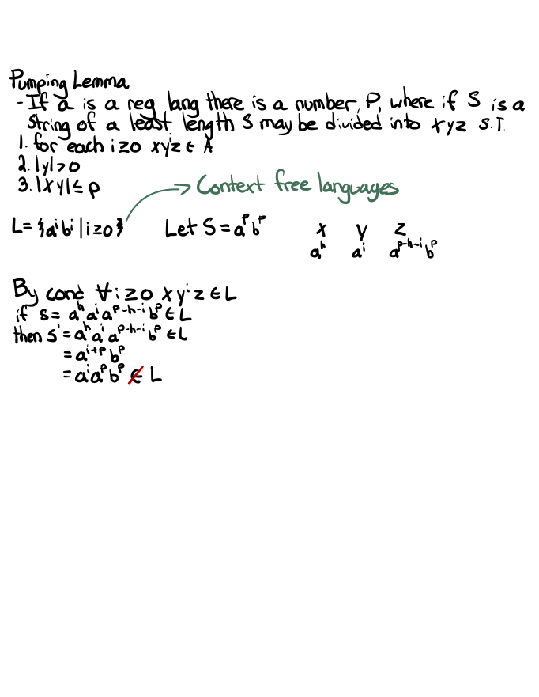

* Regular Languages
  * DFA
  * NFA
  * Expressed with Regex
* Context Free Languages
  * Push down automata (a DFA with stack memory)
  * Expressed with Context Free Grammar

Context Free Grammar

* $(V, \Sigma, R, S)$
  * $V$: a finite set of variables
  * $\Sigma$: a finite set, disjoint from $V$, called "Terminals"
  * $R$: A finite set of rules of the form $A \rarr W$ where $W \in (V \cup \Sigma)^*$
    * Any sequence of variables and terminals in any order
  * $S$: $S \in V$ called the start variable

Example:

* $Q_1$
  * $V = \{A,B\}$
  * $\Sigma = \{0, 1, \#\}$
  * $R = \{\\ \space\space\space\space\space\space A \rarr 0 A 1,\\ \space\space\space\space\space\space A \rarr B, \\ \space\space\space\space\space\space  B \rarr \#\\\}$
  * $S = A$

$S \rarr \text{ NP VP}\\$
$NP \rarr \text{Pro|DET Nominal}\\$
$VP \rarr \text {V nominal}\\$
$Pro \rarr \text{I|her|him}\\$
$DET \rarr \text{a|an|the|possessive adjective}\\$
$Nominal \rarr \text{Nominal PP | noun}\\$
$PP \rarr \text{P noun | P DET noun}\\$

Regular Languages has regular expressions, and they have these machines that tell us if it is part of the language (finite state machine)

* CFG play the role of a regular expression
* Push down automata plays the role of finite state automata
* Context free languages are analogous to regular languages

These will generate strings one step more complex than regular languages

Grammar 3:

$G_3 = (\{s\}, \{a,b\}, R, s)$  
$V=\{s\}, \Sigma=\{a,b\}, S=s$  
$R = \{ s\rarr asb | ss | \lambda\}$

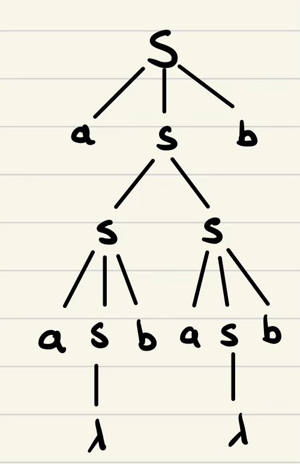

## Terminology

* Left most derivation
  * A leftmost derivation is obtained by applying production to the leftmost variable in each step
* Yields
  * $A \rarr W$
  * $UAV$ yields $UWV$
* Derives
  * $U \Rarr V$
  * $U$ derives $V$
    * if $U=V$ or $\exists$ a sequence
      * $U \Rarr U_1 \Rarr U_2 ... U_k = V$
* Language
  * Given a grammar $G$
    * $L(G) = \{w \in \Sigma^*|S \Rarr w\}$
* Ambiguous
  * A grammar is ambiguous if a string in $L(G)$ has 2 or more leftmost derivations

What is a CFL:

* $a^ib$ is regular (you can come up with a DFA to accept this)
* $a^ib^i$ is not regular (there is no DFA to accept this) it fails the pumping lemma

## Chomsky

* Chomsky normal Form
  * A context free grammar is in Chomsky normal form if every rule is of the form:
    * $A \rarr BC$
      * BC is the binary tree part
    * $A \rarr a$
      * A is the variable
    * $s \rarr \lambda$
    * where:
      * $a \in \Sigma$
      * $A, B, C \in V$
      * $s$ is a start variable

Theorem 2.9:

Any Context Free Language can be generated by a Context Free Grammar in Chomsky Normal Form

1. $S$ does not appear in the right-hand side of any rules
   1. $S \rarr ASA$
   2. $S_1 \rarr S_0$
   3. $S_0 \rarr AS_0A$
2. Eliminate all rules of the form $a \rarr \lambda$ where $A$ is not the start variable
   1. "the language cannot shrink"
   2. $A \rarr \lambda$, $R \rarr UAV$
   3. $R \rarr UV$
   4. ...
   5. $R \rarr UAVAW$
   6. $R \rarr UVAW|UAVW|UVW$
      1. if you have multiple instances of A in the RHS, you have to get rid of it by every combination
3. Remove Unit Rules:
   1. $A \rarr B$
   2. $B \rarr U$
   3. We can cut out $B$: $A \rarr U$
4. Convert remaining rules to $A rarr BC$, $A \rarr a$
   1. Let $A \rarr U_1U_2,...U_k, k \ge 3$
      1. $E \in V \cup \Sigma$
   2. $A \rarr U_1A_1$
   3. $A_1 \rarr U_2A_2$
   4. ...
   5. $A_k \rarr U_k A_k$

Continued from last one

* Chomsky normal Form
  * A context free grammar is in Chomsky normal form if every rule is of the form:
    * $A \rarr BC$
      * BC is the binary tree part
    * $A \rarr a$
      * A is the variable
    * $s \rarr \lambda$
    * where:
      * $a \in \Sigma$
      * $A, B, C \in V$
      * $s$ is a start variable

* (4.) Convert remaining rules to $A rarr BC$, $A \rarr a$
   1. Let $A \rarr U_1U_2,...U_k, k \ge 3$
      1. $U_i \in V \cup \Sigma$
   2. $A \rarr U_1A_1$
   3. $A_1 \rarr U_2A_2$
   4. ...
   5. $A_{k-2} \rarr U_{k-1}U_k$

If any $u_i$ is a terminal, replace it with $U_i$, add rule $U_i \rarr u_i$

Example:
$
S \rarr ASA|aB
A \rarr B|S
B \rarr b|\lambda
$

1. Remove $S$ from RHS
    * $S_0 \rarr S$
    * $S \rarr ASA|aB$
    * $A \rarr B|S$
    * $B \rarr b|\lambda$
2. Remove Lambda rules ($B \rarr \lambda$)
   1. Removed the lambda
       * $S_0 \rarr S$
       * $S \rarr ASA|aB|a$ (keep the variable, but add a new rule without the value that might be lambda)
       * $A \rarr B|S$
       * $B \rarr b$
   2. Eliminated the thing that pointed to $B$
       * $S_0 \rarr S$
       * $S \rarr ASA|aB|a|SA|AS$
3. Remove the unit rules
    * $S_0 \rarr S$
    * $S \rarr ASA|aB|a|SA|AS|S$
    * $A \rarr B|S$
    * $B \rarr b$
    * <>
    * $S_0 \rarr ASA|aB|a|SA|AS|S$
    * $S \rarr ASA|aB|a|SA|AS|S$
    * $A \rarr B|S$
    * $B \rarr b$
    * <>
    * $S_0 \rarr ASA|aB|a|SA|AS$
    * $S \rarr ASA|ab|a|SA|AS$
    * $A \rarr b|S$
    * $B \rarr b$
    * <>
    * $S_0 \rarr ASA|aB|a|SA|AS$
    * $S \rarr ASA|aB|a|SA|AS$
    * $A \rarr ASA|aB|a|SA|AS|b$
    * $B \rarr b$
    * <>
4. (something)
    * Change $S \rarr ASA$ (Equivalent to)
      * $A_1 \rarr SA$
      * $S_0 \rarr AA_1$
    * $S_0 \rarr AA_1|aB|a|SA|AS$
    * $S \rarr AA_1|aB|a|SA|AS$
    * $A \rarr AA_1|aB|A|SA|AS|b$
    * $A_1 \rarr SA$
    * $B \rarr b$
5. (what is labeled as 4)
    * $S_0 \rarr aB$
    * $S \rarr aB$
    * $A \rarr aB$
    * $U \rarr a$
    * $S_0 \rarr AA_1|UB|a|SA|AS$
    * $S \rarr AA_1|UB|a|SA|AS$
    * $A \rarr AA_1|UB|a|SA|AS$
    * $A_1 \rarr SA$
    * $B \rarr b$

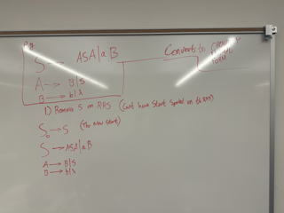

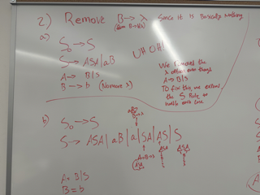

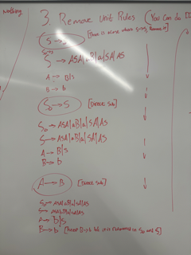

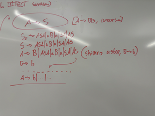

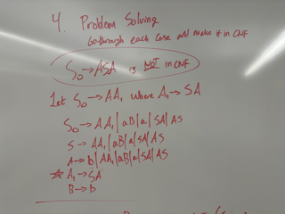

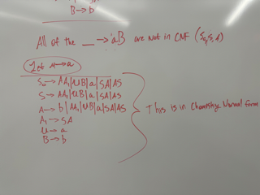

## Push Down Automata

Started this basically at the end of class

$a^ib^i$, a way to determine if it is valid is by pushing something onto the stack when they read a $a$, and then remove it from the stack when it is a b, and if the stack is empty following it, it is valid5

## Push Down Automata (Cont.)

* Schematic of FSA (Finite State Automata)
  * State Controller: The mechanism that causes the FSA to advance from state to state
* Schematic of PDA
  * State Controller:
    * The state controller controls the reading of the input (as before), but it also controls the stack
      * When we read things, we frequently push or pop things into or off the stack
        * The contents of the top of the stack and the item read will control where we move to

Stack: In PDA, stack space is unlimited because this is a theoretical concept

Terms:

* $\Gamma is the **stack** alphabet$
  * Just as $\Sigma_{\lambda} = \Sigma \cup \{\lambda \}$, there is $\Gamma_{\lambda} = \Gamma \cup \{\lambda\}$
* $\delta$
  * $Q$ X $\Sigma_{\lambda}$ X $\Gamma_{\lambda} \rarr$ the domain of a PDA
  * $P(Q$X$\Gamma_{\lambda})$
  * Delta says Given a state, some input, and the top of the stack, then I could:
    * Pop the stack
    * Push something onto the stack
    * change states

$
Q=\{a,b\} \\
\Gamma_{\lambda} = \{1,2\} \\
P(Q \times \Gamma_{lambda}) \\
P(\{(a,1),(a,2),(b,1),(b,2)\})
$

Formal Def:

* 6-Tuple
* $(Q, \Sigma_{\lambda}, \Gamma_{\lambda}, \delta, q_0, F)$
  * $Q$ is a set of states
  * $\Sigma_{\lambda}$ is an input alphabet
  * $\Gamma_{\lambda}$ is a stack alphabet
  * $\delta$ are transitions:
    * $Q \times \Sigma_{\lambda} \times \Gamma_{\lambda} \rarr P(Q \times F)$
  * $q_0$ is the start state
  * $F$ is a subset of Q that is the set of sub-states ($F \subset Q$)

Computation of a PDA

* $m = \{Q  \Sigma_|{\lambda}, \Gamma_{\lambda}, \delta, q_0, F\}$
* Input String: $w = w_1w_2...,w_m;$ each $w_i \in \Sigma_{\lambda}$
* States: $r_0,r_1,...,r_m \in Q$
* Stack Strings: $s_0,s_1,...,s_m;$ each $s_i \in \Gamma_{\lambda}^*$

A computation meets the following conditions:

1. $r_0 = q_0$ (you start where you start), $s_0 = \lambda$ (there is nothing on the stack at the beginning)
2. for $i = 0 ... m-1$, we have $(r_{i+1 }, b) \in \delta (r_i, w_{i+1}, a)$ where $s_i = at$ and $s_{i+1} = bt$ for some $a, b \in \Gamma_{\lambda}, t \in \Gamma_{\lambda}^*$
   1. $(r_{i+1 }, b)$ (push)
   2. $\delta (r_i, w_{i+1}, a)$ (pop) when performing the delta operation, and the notation has a $a$ in the design, it means that you have popped it
   3. $at$ (t are the other items on the stack)
   4. $bt$
3. $r_m \in F$
4. <!-- --->
   1. $r_{i+1}$ is the new state
   2. $b$ is the new stack top
   3. $r_i$ is the current state
   4. $w_{i+1}$ is the next character (symbol) to be read
   5. $a$ is the current stack top
5. $\delta$ rules
   1. $(r_{i+1}, b) \in \delta(r_i, w_{i+1}, a)$
      1. $r_{i+1}$ is the new state
      2. $b$ is the new stack top
      3. $r_i$ is the current state
      4. $w_{i+1}$ is the next input symbol
      5. $a$ is the current stack top
   2. 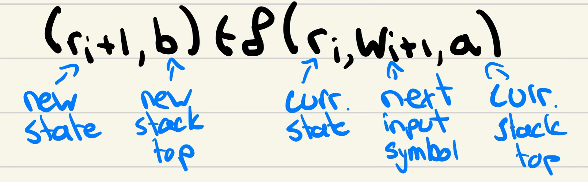
   3. 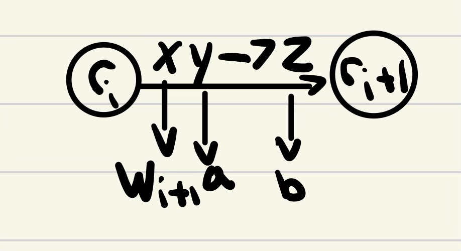
6. Operational Rules
   1. $x,y,z$ can be $\lambda$
   2. $x=\lambda$ make the transition without reading
   3. $y=\lambda$ make the transition without reading OR popping the stack
   4. $z = \lambda$ make the transition without pushing6

Context Free Grammars generate Context Free Languages

$\delta$ rules

$(r_{i+1},b) \in \delta(r_i, w_{i+1}, a)$

* $r_{i+1}$
  * new state
* $b$
  * new stack top
* $r_i$
  * the current state
  * $\in \Sigma$
* $w_{i+1}$
  * the next input symbol
* $a$
  * the current stack top

$a, b \in \Gamma^*$  
$r_{i+1} \And r_i \in \Sigma$

$x, y, z$ can be $\lambda$

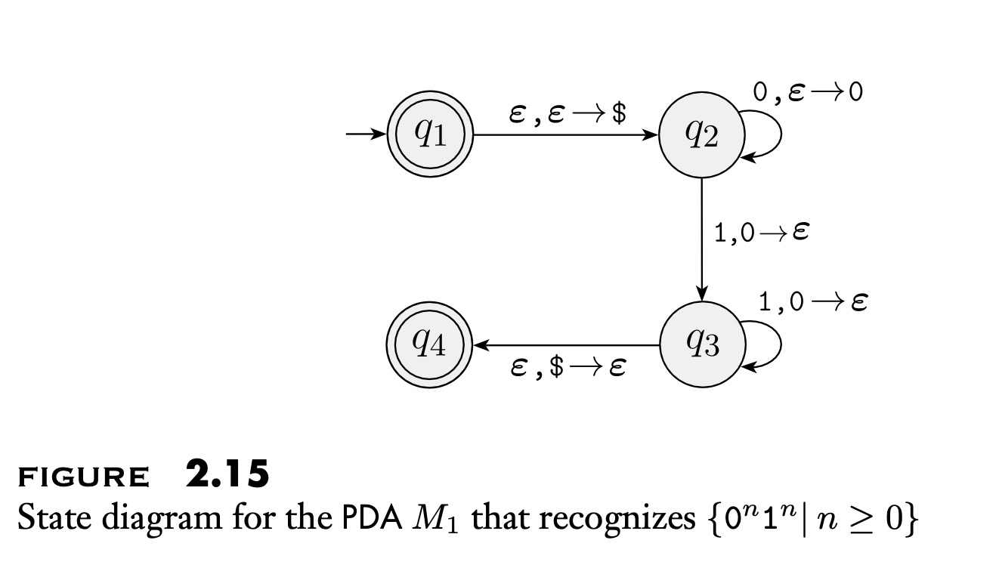

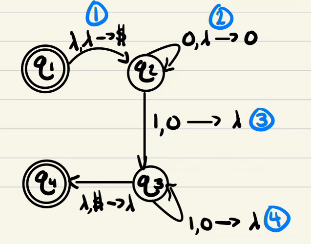

if:

* $x = \lambda$
  * make the transition without reading
* $y = \lambda$
  * make the transition without popping AND reading
* $z = \lambda$
  * make the transition without pushing

$\lambda, \lambda \rarr \$$ means that if the next input symbol is $\lambda$, and the top of the current stack is $\lambda$, then put $ on the top of the stack

$x, y \rarr z$:

* $x = w_{i+1}$ (the input symbol)
* $y = a$ the current stack top
* $z = b$ the new stack top

$L = \{a^i b^i | i \ge 0\}$

Now we can build a PDF

1. go to $q_2$ without reading, and push $
2. read 0, push 0
3. read 1, pop stack
4. read 1, pop stack

in the book $\epsilon$ is used to define $\lambda$

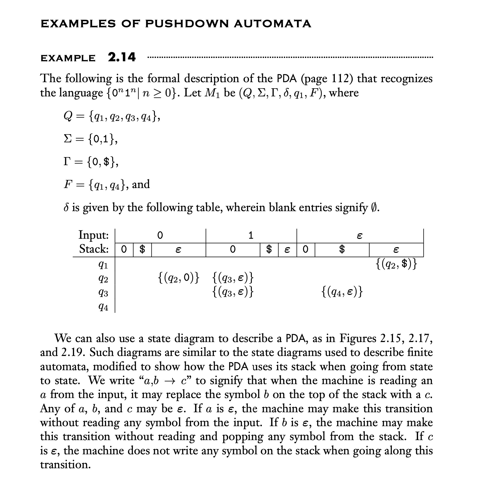

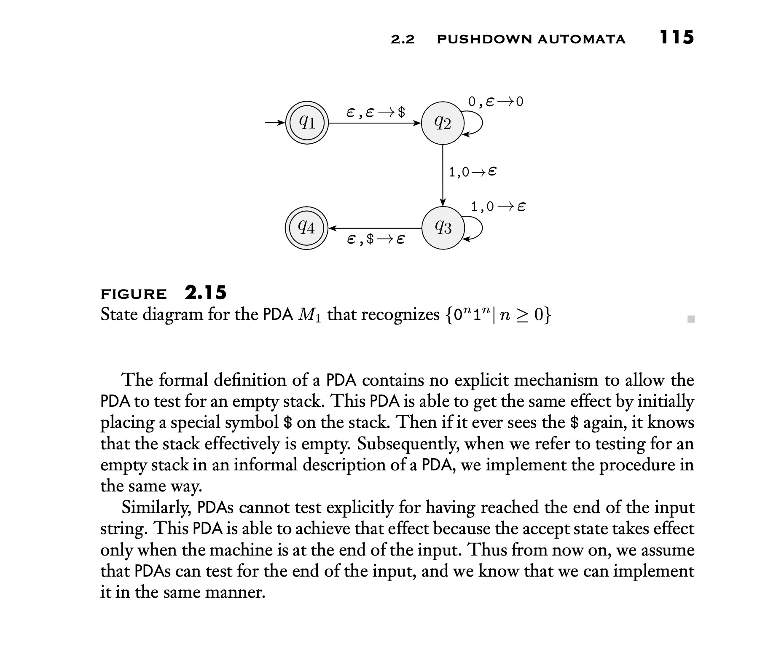

## Theorem 2.21

A language is context free if and only if there is a PDA that recognizes it

Grammar $\rarr$ PDA  
PDA $\rarr$ Grammar

Not a general proof, but this is an example that shows it can be done

Grammar:
$s \rarr aTb|b$  
$T \rarr Ta|\lambda$

Given a CFG, we are going to generate a PDA

$q_s \rarr q_{\text{loop}} \rarr q_{\text{accept}}$

* $\lambda, \lambda \rarr S\$$
* $\lambda, A \rarr w$ (rule $A \rarr w$)
* $a, a \rarr \lambda$ (termninal, $a$)
* $\lambda, \$ \rarr \lambda$ (pop $\$$)

## From PDA's to CFG's (and back)

Lemma The First (2.21)

* A language is context free if and only if some PDA recognizes it

Lemma The Second (2.27)

* If a PDA recognizes some language, $L$, $L$ is context free

States and Variables

* For each pair of states $p$ and $q$, in $P$, the corresponding grammar $G$, will have a variable $A_{pq}$ ( and associated rules)

$A_{pq}$ generates strings that take PDA form states $p$ to $q$ with stack

* empty at $p$, then empty at $q$ **or**
* non-empty at $p$ then non-empty at $q$ but with same contents

Recall $\delta$ for a PDA

* ($r_{r+1}, b) \in \delta(r_i, W_{i+1}, a)$

Modify the PDA

1. Single accept state: $q_{\text{accept}}$
2. Empties stack before accepting
3. Each transition either
   1. Pushes a sumbol or pops a symbol
   2. Does not do both in the same transition

Conventional Transition Function

* PDA can have transitions like this one:
  * read $a$, pop $z$, push $z$, travel from state $p$ to state $q$
  * $a,s \rarr z$, as an arc
  * $(q,z) \in \delta(p,a,s)$, as a transition operation

Modified

1. Repalce each transition that both pops and pushes with two functions
   1. One that pushes
   2. One that pops
2. Replace each transition that neither pops nor pushes with a two transition seuqnce that first pushes then pops an arbitrary symbol

Conseqiuences

* Since stack is empty at the beggining and transitions either push or pop
  * First move is a push
  * Last move is a pop

Two Posibilities

* PDA computes string $w$ as it moves from state $p$ to state $q$
* Possibility 1:
  * Synbol popped at the end is the symbol pushed at the begginning
  * stack is empty only at the beggining and end of computation
* Possibility 2:
  * Symbol popped at the end of the stack is notht e symbol pushed at the beggining
  * this means that somewhere during the execution, the stack becomes empty for a little bit

Rule 1 From possibility 1

* Stack is only empty at the beggining and the end of computation
* $A_{pq} \rarr a A_{rs} b$
* Where
  * $a$ is read at the first move
  * $r$ is the state following $p$
  * $s$ is the state precedding $q$
  * $b$ is read at the last move

Rule 2 From Possibility 2

* Stack can be empty mid-stream
* $A_{pq} \rarr A_{pr}A_{rq}$
* Where
  * $r$ is the state where the stack becomes empty

The Construction, Part the First

* The PDA
  * $P=\{Q,\Sigma, \Gamma, \delta, q_o, \{q_{\text{accept}}\}\}$
    * The variables in $G$
      * $V = \{A_{pq} | p, q \in Q\}$, the set of non-start variables in $G$
      * $S = A_{q_0, q_{\text{accept}}}$

The Construiction, Part 2

1. for $p, q, r, s \in Q, u \in \Gamma, \text{ and } a, b \in \Sigma_{\lambda}$
    * if $r,u \in \delta (p, a, \delta)$
      * i.e. in state $p$, read $a$, push $u$, goto $r$)
    * and $(q, \lambda) \in \delta(s,b,u)$
      * in state $s$, read $b$, pop $u$, goto $q$
    * add rule: $A_{pq} \rarr a A_{rs} b$

A crucial Equivalence

* The constriction works if we can show that there is an equivalence between $a_{pq}$ generating string $x$ and $x$ brining $P$ from $p$ with empty stack to $q$ with empty stack
* an Iff proposition
* Claim 2.30: If $A_{pq}$ generate string $x$, then $x$ can bring $P$ from $p$ with empty state to $q$ with empty stack
  * Basis: Derivation has 1 step
    * A derivation with a single step doesnt do anythihg. This implies a rule whose RHS has no variables $G$ has such a rule: $A_{pp} \rarr \lambda$ (rule of type 3 $\lambda$ takes $P$ from $p$ with empty stack to $p$ with empty stack)
      * $\lambda,\lambda \rarr \lambda$
  * Induction Hypothesis
    * Assume true for derivations of length at most $k$, $k \ge 1$, and prove true for derivations of length $k+1$.
      * That is, assume that if $A_{pq}$ generates $x$ in $k$ steps, $x$ can bring $P$ from $p$ with empty stack to $q$ with empty stack. Show that this implies the truth of derivations of length $k+1$
    * Hypothesis Implies
      * Supposed $A_{pq} \rarr^* x$ in $k+1$ and $y$ is the portion of $x$ that can be generated in $k$ steps.
      * Rules of Type 1 and Rules of Type 2
        1. $A_pq \rarr aA_{rs}b (stack empty only at gbeggining and end)
             * Let y be the portiopn of the string genreated by A_rs, so x = ayb
             * Because $A_{rs} \rarr^* y$ in $k$ steps by assumption, the IH tells us that $P$ goes from $r$ on empty stack to $s$ on empty staclk
             * Because A_pq \rarr a A_rs b is a rule of G, there are two trnasitions in P; one for pushing, one for popping:
               * $(r,u) \in \delta(p, a, \lambda)$ (go from p to r, reading a and pushing u)
             * thenr eadind string y can bring the pda to s and leave u on the stack (in k steps)
             * $(q, \lambda) \in delta(s,b,u)$ go from s to q , reading p and popping u
             * therefore the string x can bring P from p with emoty stack to q with empty stack
        2. $A_pq \rarr A_{pr}A_{rq}$ (stack becomes empty mid-stream)
            * If $A_{pq} \rarr x$, then $x$ is composed of $y$ and $z$ such that
              * $A_{pr} \rarr y$ and $A_{rq} \rarr x$
            * and each of the derivations occurs in at most $k$ steps, with empty stacks at beggining and end, by hypothesis
            * therefore $x$ can being $P$ from $p$ with emtpy stack to $q$ with empty stack
* Claim 2.31: if $x$ can being $P$ from $p$ with empty stack to $q$ with empty stack then $A_{pq}$ generates $x$
  * Take notes on this later...

Theorem 2.24
If $A$ is a CFL, there is a number $p$, where if $s$# is any string of length at least $p$, then #s# may be divided:
$S = U, VxyZ$
Such that

1. For each $i \ge 0, uv^ixy^iz \in A$
2. $|vy| \gt 0$
3. $|vxy| \le p$8

## The Pumping Lemma for Context Free Languages

Theorem 2.24

UIf $A$ is a context free language, then there is a number $P$, where if $S$ is a string of length at least $P$, then $S$ may be divided into 6 parts.  
$S = UVXYZ$  
Satisfying

1. For each $i \ge 0, u v^i x y^i z \in A$ (it can be pumped)
2. $|vy| \gt 0$ (the length of vy is greater than 0)
3. $|vxy| \le P$ (the length of vxy is less than or equal to $P$)

Example

Let $B = \{ a^n b^n c^n | n \ge 0\}$  
Show that $B$ is not context free

By contradiction, assume $B$ is context free.

* $S = a^P b^P c^P \in B$
* $|S| = 3P \ge P$
* Since $|S|$ is at least $P$, it may be divided into $S = UVXYZ$
* By condition 1, $V$ and $Y$ can be pumped
* By condition 2, $|VY| \gt 0$
  * Either $V$ of $Y$ is not empty
* Cases:
    1. $V$ or $Y$ contains more than 1 type of symbol
        * e.g.
          * $V+ab$
          * $S' = U V^2 X Y^2 Z$
          * $S' \not \in B$
    2. Both $V$ and $Y$ contain the same type of symbol
          * $U V^2 X Y^2 Z$
          * This cant be in B because you can have the same amount of As and Bs, or Bs and Cs, or As and Cs. This is because we are pumping $V$ and $Y$
* Only case 1 and case 2 can occur
* Both lead to a contradiction
* $B$ is not a contraxt free language

Let $B = \{0^k 1^k 2^k | k \ge 0\}$. We will show that $B$ isn't a CFL.

Pumping Lemma for CFLs: For every CFL $A$, there is a $p$ such that if $S \in A$ and $|s| \ge p$ then $s = uvxyz$ where

1. $uv^ixy^iz \in A$ for all $i \ge 0$
2. $vy \not{=} \epsilon$
3. $|vxy| \le p$

Informally: All long strings in $A$ are pumpable and stay in $A$.

* $D = \{ww|w \in \{0,1\}^*\}$  
* $S = 0^P 1 0^P 1 \in D$  
* $|S| > P$  
* $0^P 1$
  * 0000000...00 0 1 0 000000000...001
  * 0000000 = $u$
  * 0 = v
  * 1 = x
  * 0 = y
  * 0000...001 = z
* Pump $v, y$
  * $0^{P-1} 0^2 1 0^2 0^{P-1} 1
  * $0^{P+1} 1 0^{P+1} 1$
